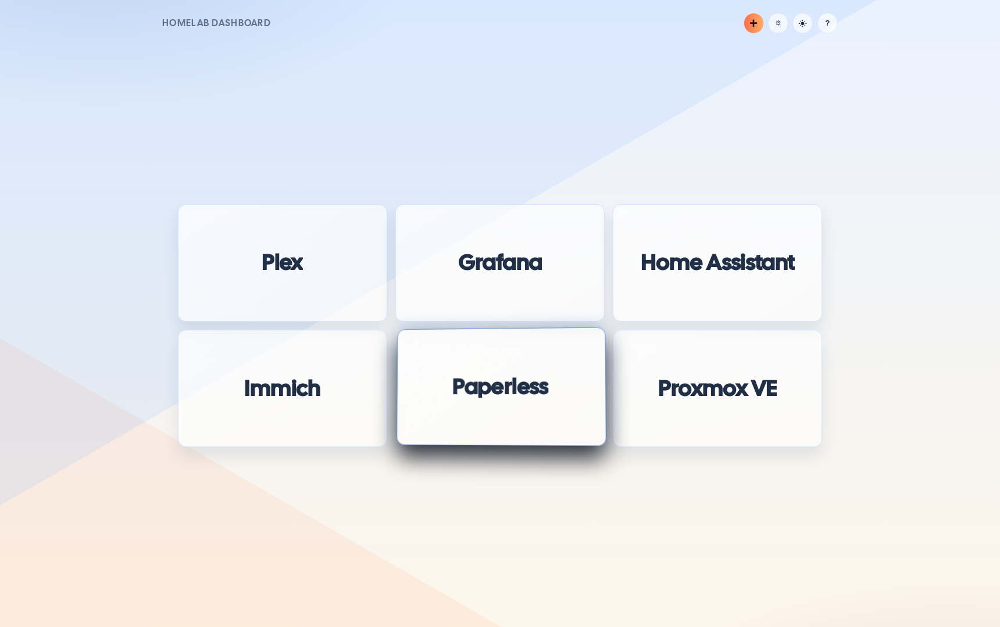
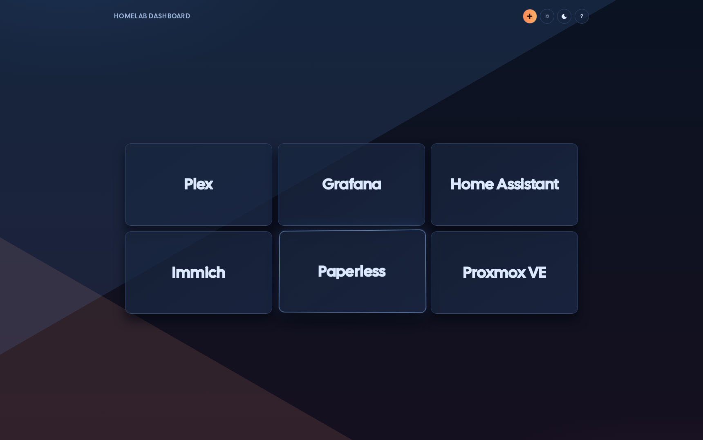

# Dashboard

Dashboard is an ASP.NET Core MVC (.NET 10) homelab launcher for self-hosted apps. It renders title-only cards in a responsive grid, stores data in SQLite, supports drag and keyboard reordering, and includes Origami light/dark themes.

## App Preview

Fresh screenshots generated with Playwright against a live test instance seeded with 6 example cards.




### Example Fields

Use these sample values when creating a card:

- `Title`: `Plex`
- `URL`: `https://plex.example.local`

This README is deployment-first for TrueNAS SCALE using Custom App YAML, with local development and GHCR publish steps included.

## Quick Start (Local)

```bash
dotnet restore Dashboard.slnx
dotnet build Dashboard.slnx
dotnet test Dashboard.slnx
dotnet run --project src/Dashboard.Web/Dashboard.Web.csproj --urls http://127.0.0.1:8080
```

Open `http://127.0.0.1:8080`.

## Features

- Title-only app cards (no visible URL text)
- Add and delete cards from the UI
- URL validation (`http://` / `https://` absolute URLs only)
- Deterministic ordering (`SortOrder`, then `Title`)
- Drag-and-drop reorder with persistence
- Keyboard reorder (`Alt+ArrowUp`, `Alt+ArrowDown`)
- Origami light/dark theme toggle with browser persistence
- SQLite persistence for simple backup/restore
- Serilog file logging with daily rolling files retained for 30 days

## Project Layout

- `src/Dashboard.Web` - MVC app, EF Core, views, static assets
- `tests/Dashboard.Web.Tests` - unit tests
- `tests/Dashboard.Web.IntegrationTests` - SQLite integration tests
- `docker-compose.yml` - production-oriented local container run
- `docker-compose.dev.yml` - containerized dev workflow
- `build.csando` - ANDO build/publish script
- `docs/deployment/truenas.md` - deployment notes

## Local Development

Requirements:

- .NET SDK 10+
- Docker + Docker Compose (for dev container workflow)

### Manual run

```bash
dotnet restore Dashboard.slnx
dotnet build Dashboard.slnx
dotnet test Dashboard.slnx
cd src/Dashboard.Web && npm install && npm run ts:build && cd ../..
dotnet run --project src/Dashboard.Web/Dashboard.Web.csproj --urls http://127.0.0.1:8080
```

### Dev container run

```bash
./run-dev.sh
```

Stop dev environment:

```bash
./stop-dev.script
```

### Frontend (TypeScript + Alpine)

Frontend behavior is authored in TypeScript under `src/Dashboard.Web/scripts/ts` and bundled to `src/Dashboard.Web/wwwroot/js/app.js` with esbuild.

```bash
cd src/Dashboard.Web
npm install
npm run ts:check
npm run ts:build
```

## ANDO Build + GHCR Publish

This repo includes `build.csando`.

Run build/test pipeline:

```bash
ando
```

Authenticate to GHCR:

```bash
echo "$GHCR_TOKEN" | docker login ghcr.io -u "$GHCR_USERNAME" --password-stdin
```

Publish multi-arch image (`linux/amd64`, `linux/arm64`) to GHCR:

```bash
GHCR_OWNER=<github-owner> GHCR_IMAGE=dashboard ando -p publish
```

Optional override tag:

```bash
GHCR_OWNER=<github-owner> GHCR_IMAGE=dashboard IMAGE_TAG=1.0.0 ando -p publish
```

Resulting tags:

- `ghcr.io/<github-owner>/dashboard:<version-or-IMAGE_TAG>`
- `ghcr.io/<github-owner>/dashboard:latest`

If the GHCR package is private, configure image pull credentials in TrueNAS (Apps -> Manage Container Images / Registry Credentials) and reference that credential when creating the Custom App.

## TrueNAS SCALE Deployment (Custom App YAML)

### Overview

Use TrueNAS Apps -> Discover Apps -> Custom App and paste YAML. Mount a single persistent dataset to `/app/storage`.

Security note: this app has no built-in auth. Keep it on LAN/VPN-only networks.

## Prerequisites

1. TrueNAS SCALE Apps pool configured.
2. Dataset created for app data, for example:
   - `/mnt/tank/apps/dashboard/data`
3. Dataset writable by the container runtime user (or equivalent ACL).
4. Docker image available in GHCR.

## Recommended environment values

- `ConnectionStrings__DashboardDb=Data Source=/app/storage/data/dashboard.db`

## Custom App YAML (ready to paste)

Replace `<github-owner>` and adjust host path/port to your environment.

```yaml
services:
  dashboard:
    image: ghcr.io/<github-owner>/dashboard:latest
    pull_policy: always
    container_name: dashboard-web
    restart: unless-stopped
    environment:
      ConnectionStrings__DashboardDb: Data Source=/app/storage/data/dashboard.db
    ports:
      - "18080:8080"
    volumes:
      - /mnt/tank/apps/dashboard:/app/storage
```

Notes:

- `18080` is the NAS host port in this example.
- `8080` is the container port used by the app (image default).
- `ASPNETCORE_ENVIRONMENT=Production` and `ASPNETCORE_URLS=http://+:8080` are already set by the image defaults.
- Use a fixed image tag (for example `:1.0.0`) if you want controlled upgrades.
- Only one volume is mounted. The app creates `/app/storage/data` and `/app/storage/logs` at startup.

## Deploy steps in UI

1. Apps -> Discover Apps -> Custom App -> Install.
2. Name: `dashboard`.
3. Paste YAML above.
4. Save/Install.
5. Open `http://<truenas-ip>:18080`.

## First-time database bootstrap

Current app behavior auto-applies EF migrations in `Development` only.
For a fresh TrueNAS deployment, do this once:

1. In the Custom App YAML, set:
   - `ASPNETCORE_ENVIRONMENT: Development`
2. Deploy/redeploy and load the app once.
3. Change it back to:
   - `ASPNETCORE_ENVIRONMENT: Production`
4. Redeploy again.

After bootstrap, keep it on `Production`.

## Persistence validation

1. Add at least one card in the UI.
2. Restart the app from TrueNAS Apps UI.
3. Confirm cards remain.

Equivalent CLI check (outside TrueNAS UI where available):

```bash
docker compose restart dashboard
```

## Upgrade process

1. Publish new image to GHCR (new tag).
2. Edit Custom App YAML image tag.
3. Save/redeploy app.
4. Validate dashboard loads and cards persist.

## Backup and restore

Back up the dataset mounted to `/app/storage` (minimum file: `data/dashboard.db`).

Restore procedure:

1. Stop app.
2. Restore dataset/files.
3. Start app.
4. Validate cards and ordering.

## Runtime Configuration

| Variable | Default | Notes |
| --- | --- | --- |
| `ConnectionStrings__DashboardDb` | `Data Source=/app/storage/data/dashboard.db` | SQLite DB location inside container |
| `ThemeOptions__DefaultTheme` | `origami-light` | Default if browser `localStorage` has no theme value |
| `ASPNETCORE_ENVIRONMENT` | `Production` | Use `Development` only for local dev |
| `ASPNETCORE_URLS` | `http://+:8080` | Container bind address/port |

Logging defaults:

- Production file logs: `/app/storage/logs/dashboard-.log`
- Rolling interval: daily
- Retention: 30 files (roughly 30 days)
- Because `/app/storage` is volume-mounted in TrueNAS YAML, logs are persisted on disk with application data.

## Troubleshooting

- App starts but cards do not persist:
  - Check host volume path exists and is writable.
  - Confirm DB env var points to `/app/storage/data/dashboard.db`.
- Port unavailable:
  - Change host port mapping (for example `18081:8080`).
- Theme toggle not persisted:
  - Browser may block `localStorage`; app falls back to configured default theme.
- Invalid URL rejected:
  - Ensure URL is absolute and starts with `http://` or `https://`.

## Testing

Run all tests:

```bash
dotnet test Dashboard.slnx
```

Current automated coverage includes URL validation, deterministic ordering, and reorder persistence across DB context restarts.

### Docker Playwright E2E

Run the full end-to-end suite in Docker:

```bash
./scripts/run-e2e-docker.sh
```

This covers:

- create card, validation, delete
- drag reorder persistence
- keyboard reorder persistence
- system dark-mode default + user theme persistence
- persistence across dashboard container restart

E2E assets:

- Compose stack: `docker-compose.e2e.yml`
- Playwright project: `tests/e2e`
