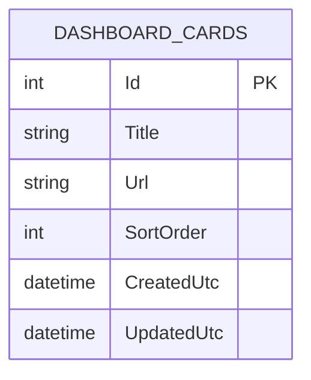

# feat: ASP.NET MVC homelab dashboard with Origami light/dark themes

## Enhancement Summary
**Deepened on:** 2026-02-18  
**Sections enhanced:** 11  
**Scope:** Architecture, schema constraints, theme system, deployment hardening, test strategy, operations

### Key Improvements
1. Added concrete .NET 10 + EF Core SQLite wiring and migration flow.
2. Added robust card URL validation, anti-forgery posture, and input guardrails.
3. Added explicit TrueNAS persistence and container runtime requirements.
4. Added origami light/dark tokenized theming strategy and hover/focus behavior.
5. Added implementation-ready file map, snippets, and phased delivery checkpoints.

### New Considerations Discovered
- SQLite durability in containers depends on explicit data volume ownership and write permissions.
- App-level anti-forgery and strict URL scheme validation are required even on LAN-only deployments.
- Theme persistence should be resilient to unavailable `localStorage` and honor default config.

## Overview
Build a single-user ASP.NET MVC dashboard for self-hosted network apps, backed by SQLite, containerized for TrueNAS. The dashboard shows clickable cards (title only) in a responsive top-left grid and supports two UI themes: Origami Sky Light and Origami Sky Dark.

### Research Insights
**Best Practices:**
- Keep the app server-rendered and simple (MVC + Razor) to minimize operational overhead.
- Use explicit app data path (`/app/data/dashboard.db`) and mount it to persistent storage.

**Performance Considerations:**
- `AsNoTracking()` for dashboard read queries.
- Keep initial payload minimal (title + link only) for fast first paint.

## Problem Statement / Motivation
Current app access is fragmented across bookmarks and URLs. A local dashboard centralizes navigation with a fast visual layout, minimal admin overhead, and persistent data that survives container restarts.

### Research Insights
**Operational Value:**
- A persistent SQLite file and lightweight MVC app keep backup/restore and redeploy trivial.
- Single-user/no-auth scope lowers complexity but still requires LAN segmentation hygiene.

## Research Summary
- Brainstorm docs: none found in `docs/brainstorms/`.
- Repo patterns/learnings docs: none found in `docs/solutions/`.
- External docs used for deepening:
  - EF Core + SQLite provider and setup
  - ASP.NET Core DbContext config patterns
  - ASP.NET Core anti-request forgery guidance
  - Dockerized app persistence guidance in TrueNAS docs

## Proposed Solution
Implement a server-rendered MVC app with:
- Card storage in SQLite (`DashboardCards` table).
- Simple management UI (create, delete, and drag/reorder in MVP; optional edit in phase 2).
- Dashboard page rendering title-only cards linking in same tab.
- Responsive CSS Grid flow starting at top-left.
- Theme system with two selectable modes:
  - `origami-light`
  - `origami-dark`
- Containerization optimized for TrueNAS with persisted `/app/data` volume for DB.

### Research Insights
**Implementation Details:**
- Add `ThemeOptions:DefaultTheme` in `appsettings.json` (`origami-light` default).
- Persist selected theme in `localStorage` and apply via `data-theme` on `<html>`.
- Add server-side URL parsing (`Uri.TryCreate`) plus scheme allowlist.
- Add reorder endpoint/action that accepts ordered card IDs and rewrites `SortOrder` atomically.

## Technical Considerations
- Framework: ASP.NET Core MVC on .NET 10.
- Persistence: EF Core + SQLite.
- No authentication/authorization layer.
- URL validation: require absolute `http://` or `https://` links.
- Security baseline:
  - Output encode titles in Razor.
  - Add anti-forgery validation on form posts.
  - Disallow `javascript:` and malformed schemes.
- UX baseline:
  - Cards show title only (no visible URL).
  - Large title typography (inspired by approved Origami design).
  - Keyboard-focus styles for accessibility.
- Theme persistence strategy:
  - Store current theme in `localStorage` (per-browser).
  - Keep default theme configurable in `appsettings`.

### Research Insights
**Best Practices:**
- Use data annotations for baseline validation, then enforce URL rules in model binder/service layer.
- Keep card writes synchronous from user perspective (create/delete returns to index with status message).

**Security Considerations:**
- Apply `[ValidateAntiForgeryToken]` on create/delete actions.
- CSP for this iteration: defer strict CSP header enforcement to post-MVP hardening and track as a follow-up item.
- Validate and normalize user input before persistence.

**Implementation Snippets:**
```csharp
// src/Dashboard.Web/Program.cs
var builder = WebApplication.CreateBuilder(args);

builder.Services.AddControllersWithViews();
builder.Services.AddDbContext<AppDbContext>(options =>
    options.UseSqlite(builder.Configuration.GetConnectionString("DashboardDb")));
```

```csharp
// src/Dashboard.Web/Validation/UrlValidator.cs
public static bool IsAllowedDashboardUrl(string value)
{
    if (!Uri.TryCreate(value, UriKind.Absolute, out var uri)) return false;
    return uri.Scheme is "http" or "https";
}
```

## Data Model



### Research Insights
**Schema Constraints:**
- `Title`: required, max 120 chars.
- `Url`: required, max 2048 chars.
- `SortOrder`: non-null, default 0.
- Add composite index on (`SortOrder`, `Title`) for deterministic retrieval.

**Migration Notes:**
- Initial migration includes constraints and default timestamps.
- Deployment policy (chosen): run migrations explicitly during deployment (`dotnet ef database update`) and do not auto-migrate on app startup in production/TrueNAS.

## MVC Structure (Proposed)
- `src/Dashboard.Web/Controllers/HomeController.cs`: dashboard list view.
- `src/Dashboard.Web/Controllers/CardsController.cs`: create/delete/edit actions.
- `src/Dashboard.Web/Models/DashboardCard.cs`: EF entity.
- `src/Dashboard.Web/Data/AppDbContext.cs`: EF context.
- `src/Dashboard.Web/Views/Home/Index.cshtml`: card grid UI.
- `src/Dashboard.Web/Views/Cards/_CardForm.cshtml`: add/edit form partial.
- `src/Dashboard.Web/wwwroot/css/site.css`: Origami light/dark tokens and layouts.
- `src/Dashboard.Web/wwwroot/js/theme.js`: theme toggle + persistence.
- `Dockerfile`: multi-stage publish/runtime image.
- `docker-compose.yml`: local run + mounted SQLite volume.

### Research Insights
**Expanded File Plan:**
- `src/Dashboard.Web/Models/CardFormModel.cs`: input DTO with validation attributes.
- `src/Dashboard.Web/Models/ReorderCardsRequest.cs`: payload for card order updates.
- `src/Dashboard.Web/Services/CardService.cs`: centralize create/delete/query logic.
- `src/Dashboard.Web/Views/Shared/_ThemeToggle.cshtml`: reusable light/dark switch.
- `src/Dashboard.Web/Views/Shared/_Layout.cshtml`: theme bootstrapping script early in `<head>` to avoid flash.
- `src/Dashboard.Web/wwwroot/js/reorder.js`: drag-and-drop + keyboard reorder interactions.

## SpecFlow Analysis (Gaps + Edge Cases)
- Empty state: first run has no cards; show clear “Add your first app” CTA.
- Duplicate entries: allow duplicate titles, but consider URL duplicate warning (non-blocking).
- Invalid URLs: reject with model validation message.
- Long titles: clamp/wrap safely without layout break.
- Mobile layout: ensure min card width and readable tap target.
- Ordering: cards should be deterministic (`SortOrder`, then `Title`).
- Theme fallback: if `localStorage` unavailable, default to light.

### Research Insights
**Additional Edge Cases:**
- Handle trailing slash and host-case normalization for duplicate URL checks.
- Ensure delete action is idempotent (deleting nonexistent ID returns success redirect + warning).
- Provide empty-title rejection server-side even if client-side validation is bypassed.
- Reorder payload with missing/unknown IDs should be rejected and leave existing order unchanged.
- Failed reorder write should roll back to previous order in a single transaction.

## Acceptance Criteria
- [x] Dashboard renders cards in a responsive top-left grid with no visible URL text.
- [x] Card title is large and readable in both Origami light and Origami dark themes.
- [x] Clicking a card opens its stored link in the same window.
- [x] User can add a new card with `Title` + `URL` via UI form.
- [x] URL validation blocks invalid/non-http(s) links.
- [x] User can delete a card.
- [x] Card order is deterministic using `SortOrder` ascending, then `Title` ascending.
- [x] User can drag cards to reorder them and refreshed page reflects the new order.
- [x] Keyboard-accessible reorder is supported (focus card and move up/down).
- [ ] Card data persists in SQLite across container restarts.
- [x] Theme toggle switches between Origami light/dark and persists per browser.
- [x] App runs via Docker with bind-mounted `/app/data` for SQLite.
- [x] TrueNAS deployment notes are documented.

### Quality Gates
- [x] `dotnet test` passes (unit + integration).
- [ ] Manual verification complete on mobile and desktop breakpoints.
- [ ] Container restart test confirms persistence.
- [x] Integration test confirms deterministic ordering (`SortOrder`, then `Title`).
- [ ] Integration test confirms reorder persists across app restart.

## Implementation Plan

### Phase 1: Foundation
- Create MVC project skeleton and EF Core SQLite wiring.
- Add `DashboardCard` entity and initial migration.
- Seed optional demo cards for first-run preview.

**Deliverables:**
- `src/Dashboard.Web` scaffolded
- `DashboardDb` connection string in `appsettings*.json`
- initial migration generated and applied

### Phase 2: Core Features
- Build dashboard grid view with title-only cards.
- Implement add/delete card flows with server-side validation.
- Add deterministic card ordering.
- Implement drag-and-drop reorder interaction and server persistence.

**Deliverables:**
- Home index with top-left auto-flow grid
- Create/delete flows with anti-forgery
- Validation messages for bad URLs
- Reorder endpoint/action with transactional `SortOrder` updates
- Pointer + keyboard reorder interactions in UI

### Phase 3: Theming + Polish
- Port approved Origami Sky Light theme.
- Add Origami Sky Dark theme variant and toggle control.
- Ensure hover treatment and focus styles are polished.
- Verify responsive behavior at mobile/tablet/desktop widths.

**Deliverables:**
- CSS variable token sets for both themes
- theme toggle partial + JS persistence
- hover/focus states matching approved demos

### Phase 4: Container + Ops
- Add production Dockerfile (multi-stage build).
- Add compose example with volume mapping for DB durability.
- Write TrueNAS run instructions and required env vars.

**Deliverables:**
- runnable container image
- `docker-compose.yml` for local and NAS-style volume config
- deployment doc (`docs/deployment/truenas.md`)

## Testing Strategy
- Unit tests:
  - URL validator accepts only `http/https` absolute links.
  - Card ordering logic returns stable order.
  - Reorder service rewrites `SortOrder` deterministically and transactionally.
- Integration tests:
  - Create card persists to SQLite and appears on index.
  - Delete card removes it from index and DB.
  - Reorder request updates list order and persists after restart.
- Manual UI checks:
  - Theme toggle behavior and persistence.
  - Grid wrapping and top-left flow at common breakpoints.
  - Drag-and-drop reorder works on desktop and touch.
  - Keyboard reorder works with visible focus states.

### Research Insights
**Recommended Test Files:**
- `tests/Dashboard.Web.Tests/Validation/UrlValidatorTests.cs`
- `tests/Dashboard.Web.Tests/Services/CardServiceTests.cs`
- `tests/Dashboard.Web.Tests/Services/CardReorderServiceTests.cs`
- `tests/Dashboard.Web.IntegrationTests/CardsFlowTests.cs`

**Container Validation Script:**
```bash
# scripts/verify-persistence.sh
docker compose up -d --build
# create card via UI automation or direct SQLite insert in test setup
# restart and verify data still present
docker compose restart
```

## Dependencies & Risks
- SQLite file permissions in container volume on TrueNAS.
- Potential broken links from internal hostnames/IP changes.
- No auth means LAN exposure should be controlled via network boundary.

### Mitigations
- Run container as explicit UID/GID matching dataset permissions.
- Keep app behind LAN/VPN boundary; do not expose directly to WAN.
- Back up SQLite file or dataset snapshots regularly.

## Success Metrics
- New card creation to visible dashboard entry in under 10 seconds.
- Dashboard first paint under 1 second on local LAN hardware.
- Zero data loss across container restart/redeploy in validation test.

## References & Inputs
- Approved style reference (light): `demos/origami-sky.html`
- Approved style reference (dark): `demos/origami-sky-dark.html`
- Hover treatment reference: `demos/origami-sky-dark.html` (`.demo-hover` card)

### External References
- EF Core SQLite provider docs: https://learn.microsoft.com/en-us/ef/core/providers/sqlite/
- ASP.NET Core DbContext configuration: https://learn.microsoft.com/en-us/aspnet/core/data/ef-mvc/intro
- ASP.NET Core anti-request forgery: https://learn.microsoft.com/en-us/aspnet/core/security/anti-request-forgery
- TrueNAS app persistence/storage docs: https://www.truenas.com/docs/truenasapps/managing-apps/
